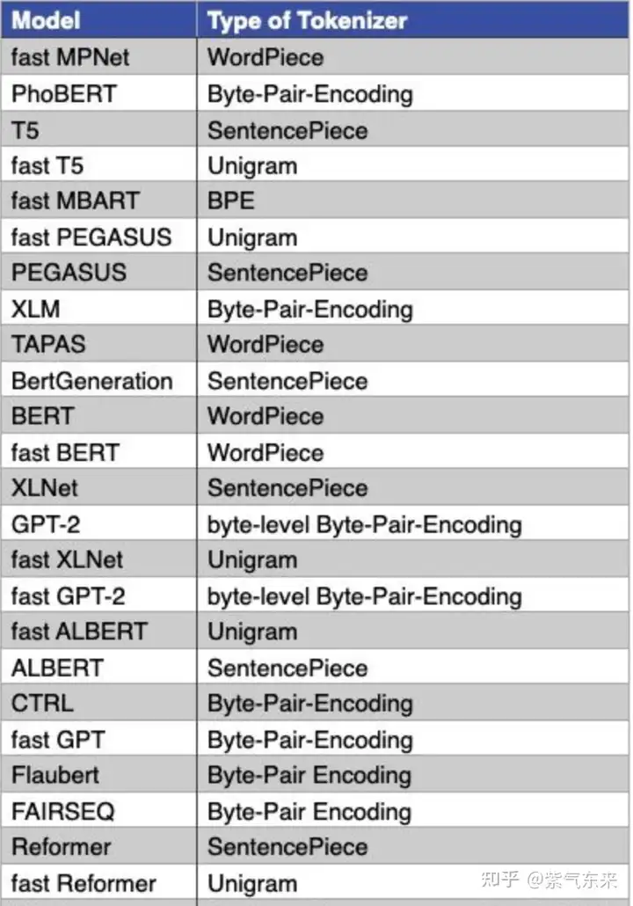

# 分词

- 分词（tokenization，也叫word segmentation）是一种操作，它按照特定需求，把文本切分成一个字符串序列(其元素一般称为token，或者叫词语)
  
## 中文分词
中文分词(Chinese Word Segmentation) 指的是将一个汉字序列切分成一个个单独的词。分词就是将连续的字序列按照一定的规范重新组合成词序列的过程
1. 基本问题
   - 分词规范
        “词是什么”(词的抽象定义)及“什么是 词”(词的具体界定)，这两个基本问题有点飘忽不定，迄今拿不出一 个公认的、具有权威性的词表来。主要困难出自两个方面:一方面是单 字词与词素之间的划界，另一方面是词与短语(词组)的划界
   - 歧义切分
        歧义字段在汉语文本中普遍存在，处理这类问题可能需要进行复杂的上下文语义分析，甚至韵律分析(语气、重音、停顿等)
        ```
        例如：“结合成” 
        一种切分为:(a)结合│成;另一种切分为:(b)结│合成
        ```
   - 未登录词问题
        未登录词又称为生词(unknown word)，可以有两种解释:一是指 已有的词表中没有收录的词;二是指已有的训练语料中未曾出现过的词，又称之为集外词(out of vocabulary，OOV)
2. 分词方法
   | 方法                   | 典型算法                                                                                                                                                    | 特点                                                                                                                                                                                                                                               |
   | ---------------------- | ----------------------------------------------------------------------------------------------------------------------------------------------------------- | -------------------------------------------------------------------------------------------------------------------------------------------------------------------------------------------------------------------------------------------------- |
   | 基于词典的方法         | 正向最大匹配法（从左到右；逆向最大匹配法（从右到左）；最小切分（每一句中切出的词数最小）双向最大匹配（进行从左到右、从右到左两次扫描）                      | 本质上就是字符串匹配的方法，将一串文本中的文字片段和已有的词典进行匹配，如果匹配到，则此文字片段就作为一个分词结果。但是基于词典的机械切分会遇到多种问题，最为常见的包括歧义切分问题和未登录词问题                                                 |
   | 基于统计的方法         | N-最短路径方法、基于词的n元语法模型的分词方法、由字构词的汉语分词方法、基于词感知机算法的汉语分词方法、基于字的生成式模型和区分式模型相结合的汉语分词方法等 | 基于统计的分词方法是在给定大量已经分词的文本的前提下，利用统计机器学习模型学习词语切分的规律（称为训练），从而实现对未知文本的切分。例如最大概率分词方法和最大熵分词方法等                                                                         |
   | 基于深度学习的分词方法 | LSTM+CRF、BiLSTM+CRF等                                                                                                                                      | 深度学习方法为分词技术带来了新的思路，直接以最基本的向量化原子特征作为输入，经过多层非线性变换，输出层就可以很好的预测当前字的标记或下一个动作。在深度学习的框架下，仍然可以采用基于子序列标注的方式，或基于转移的方式，以及半马尔科夫条件随机场。 |

3. 分词工具开源
    - Jieba：“结巴”中文分词：做最好的 Python 中文分词组件(https://github.com/fxsjy/jieba)
    - SnowNLP：SnowNLP是一个python写的类库，可以方便的处理中文文本内容(https://github.com/isnowfy/snownlp)
  
## 英文分词
在英文中，tokenize的目标是把输入的文本流，切分成一个个子串，每个子串相对有完整的语义，便于学习embedding表达和后续模型的使用。下面通过 Huggingface 的 tokenizers工具来简要讨论
tokenize有三种粒度：word/subword/char
- word词，是最自然的语言单元。对于英文等自然语言来说，存在着天然的分隔符，比如说空格，或者是一些标点符号，对词的切分相对容易。但是对于一些东亚文字包括中文来说，就需要某种分词算法才行。顺便说一下，Tokenizers库中，基于规则切分部分，采用了spaCy和Moses两个库。如果基于词来做词汇表，由于长尾现象的存在，这个词汇表可能会超大。像Transformer XL库就用到了一个26.7万个单词的词汇表。这需要极大的embedding matrix才能存得下。embedding matrix是用于查找取用token的embedding vector的。这对于内存或者显存都是极大的挑战。常规的词汇表，一般大小不超过5万
- char/字符, 也就是说，我们的词汇表里只有最基本的字符。而一般来讲，字符的数量是少量有限的。这样做的问题是，由于字符数量太小，我们在为每个字符学习嵌入向量的时候，每个向量就容纳了太多的语义在内，学习起来非常困难
- subword子词级，它介于字符和单词之间。比如说Transformers可能会被分成Transform和ers两个部分。这个方案平衡了词汇量和语义独立性，是相对较优的方案。它的处理原则是，常用词应该保持原状，生僻词应该拆分成子词以共享token压缩空间

1. 常用Tokenizer算法
   