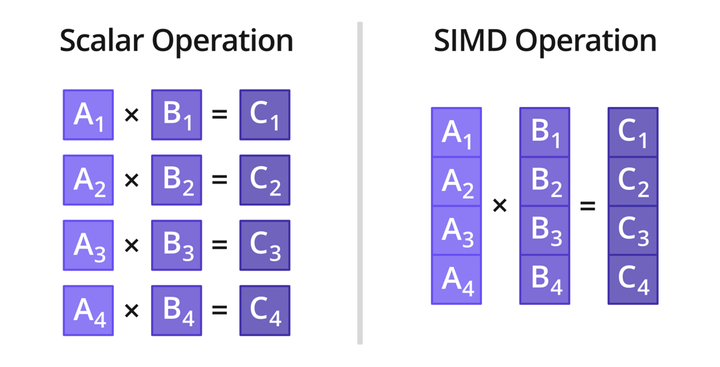
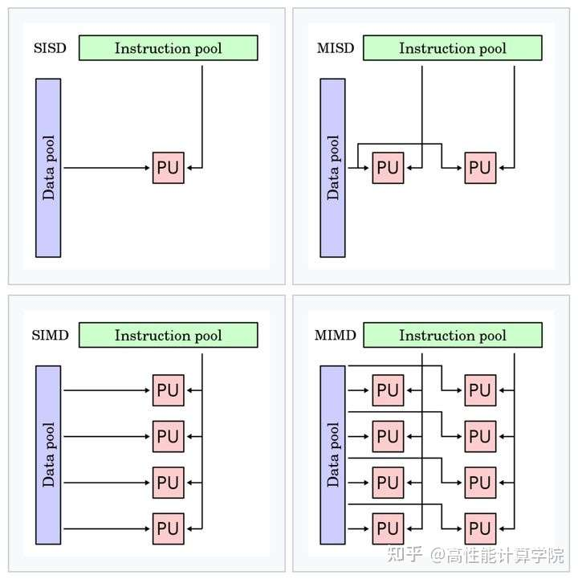

# 简介
- Neon汇编是一种针对ARM架构处理器的一种汇编语言，是一种SIMD（单指令多数据）架构的扩展，它允许处理器同时对多个数据执行相同的操作，从而显著提高处理速度，特别是对于处理多媒体和图形数据。Neon指令集提供了许多操作，如加法、减法、乘法、比较和浮点运算，这些操作可以在128位的寄存器上同时作用于16位、32位、64位的数据元素。Neon寄存器是128位的，可以被视为1个128位、2个64位、4个32位、8个16位或者16个8位的数据元素。Neon汇编通常也被用于优化性能，如视频编解码、图像处理和音频处理等。

### SIMD
- ARM NEON 是适用于 ARM Cortex-A 和 Cortex-R 系列处理器的一种 SIMD（Single Instruction Multiple Data）扩展架构。

- SIMD 采用一个控制器来控制多个处理器，同时对一组数据（又称“数据向量”）中的每个数据分别执行相同操作，从而实现并行技术。

- SIMD 特别适用于一些常见的任务，如音频图像处理。大部分现代 CPU 设计都包含了 SIMD 指令，来提高多媒体使用的性能

如上图所示，标量运算时一次只能对一对数据执行乘法操作，而采用 SIMD 乘法指令，则一次可以对四对数据同时执行乘法操作

### 指令流与数据流
费林分类法根据指令流（Instruction）和数据流（Data）的处理方式进行分类，可分成四种计算机类型：
