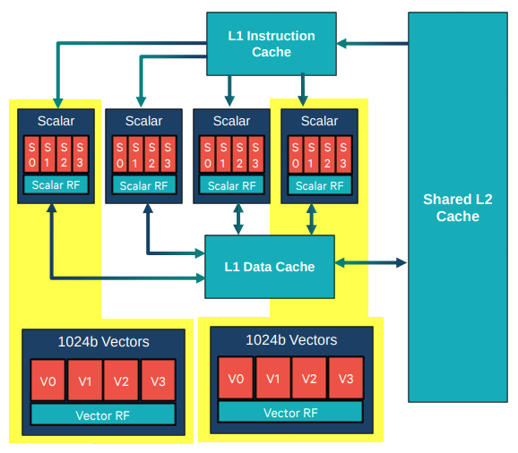
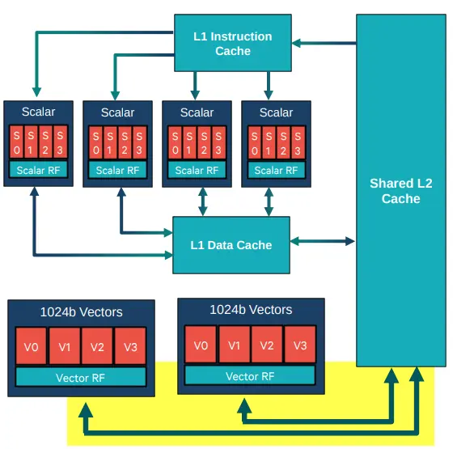

# 移动端算法优化背景
- 相比于服务器端和云端算法，移动端算法落地困难重重，主要原因有以下几点：
  1. 受限于芯片的封装面积、功耗、散热等因素，移动端处理器的性能远低于服务器端处理器的性能，除此之外，在移动端上还有内存、存储空间、网络带宽等居多限制。
  2. 越来越多的移动端影像算法应用的需求，同时对于影像算法的效果的要求也是越来越高，这又对移动端平台的计算能力提出了更高的要求。
  3. 移动端很多应用场景对于影像算法的实时性要求很高，以手机相机为例，拍照时间长、拍照卡顿、手机发烫这些问题会直接减低用户的使用体验。
- 优化方向
  1. 在平台方面：移动平台的算力要持续提升，以高通芯片为例，从 855 到 865 再到 888，可以看到每代芯片在算力上都有很大的提升。
  2. 在算法方面：在确保效果的前提下尽量的简化算法的复杂度，这也是体现算法研发功底的地方。
  3. 在算法优化方面：要结合算法的特性和平台的计算资源对算法做代码级的优化以提升算法的性能，要做到选择最优的实现方法以及充分发挥硬件的计算能力。
  4. 在系统架构方面：要做更高维度的优化，合理的进行资源的调度和分配，优化算法处理流程，提升整体的性能。
   
# 高通移动端系统架构

- CPU：对应上图中的① (Kryo subsystem)，基于 ARM Cortex 架构的 64 位处理器，目前移动端的 CPU 处理器基本上都是基于 ARM 架构的，为应对多媒体密集的计算需求引入 Neon 指令集扩展，并且支持浮点运算，优点是开发简单、使用方便，可移植性好，缺点是计算能力偏弱，而且由于 CPU 资源竞争导致性能上存在很大的波动，功耗偏高，适用于逻辑控制模块，计算量不是很大或者不便于做矢量处理的模块，实现的时候一般采用 Neon (intrinsic 或者汇编) + 多线程的方式。
- GPU：对应上图中的③ (Multimedia subsystem) 中的 Qualcomm Adreno 部分，在 Android 手机的 GPU 领域主要是高通 Adreno 系列和 ARM Mali 系列两大类，GPU 的优点是并行线程多，支持向量化的处理，算力强，存在的缺点是功耗高，存在 UI 渲染资源竞争导致性能存在抖动，适用于适合计算密度高，逻辑简单的算法处理，实现的时候一般采用 OpenCL，OpenGL 或者 Vulkan 等方式。
- DSP：对应上图中的⑨ (Compute subsystem) ，DSP 是专有处理器，优点是计算能力很强，具有更大的 SIMD 指令位宽，更灵活的超长指令字设计，直接高效的内存访问模型，运行效率稳定，资源竞争少，功耗低，缺点是开发难度极大，算法中计算量大或者性能瓶颈模块往往需要采用 DSP来处理，一般采用 DSP 提供的专有指令 (intrinsic 或者汇编)来实现，如高通 hexagon DSP 中的 HVX 指令。
- NPU：对应上图中的⑫ (Qualcomm Neural Processing Unit)，专门用于神经网络硬件加速的处理器，针对神经网络的特点专门设计了硬件结构和处理器指令，带来的好处是相比于 CPU 和 GPU，功耗会低很多，处理时间会有数量级上的提升，缺点是神经网络的设计依赖于 NPU 支持的算子操作，灵活性不高，模型推理的时候需要进行量化，在精度上会有一些影响。实现的时候一般采用 NPU 提供的推理框架，比如高通的 SNPE 和 QNN 。

# Hexagon DSP
Hexagon 是高通公司数字信号处理器 (DSP) 产品系列的品牌名称，Hexagon 也称为 QDSP6，代表“第六代数字信号处理器”。 第一代 QDSP6 V1 在 2006 年便已经推向市场，距现在已经过去十几年。据高通称，Hexagon 架构旨在为各种应用提供低功耗的性能，用于高通骁龙芯片，面向智能手机、汽车、可穿戴设备和其他移动设备，也用于蜂窝电话网络的组件。

## 高通 SOC 架构图

- 模块 DSP 主要包含主处理器（标量处理器）、协处理器 HVX（Hexagon Vector Extensions 矢量处理器）及其他处理核心。

## HVX 的优势
- 更强的数据并行处理能力，1024b 指令位宽，且有多个线程可并行，线程里面每个 packet 可同时并行执行四条指令。
- 更低的功耗。
- 更高的运行稳定性。


## DSP 硬件架构

如上图所示，我们所开发的主要涉及三个硬件资源：
- 主处理器（标量处理单元）
- HVX 协处理器（矢量处理单元）
- memory （VTCM 等）

## HVX 架构 - 线程模型

- 主处理器主要负责标量运算，有 4 个（目前新架构已调整至 6 个）硬件线程（每个拥有 4 路 VLIW，共享 L1/L2）。
- 向量化运算由 2 个 HVX context 组成（目前新架构已调整至 4 个），分别会被多个标量线程控制。
- 主处理器和 HVX 都是可以有多个软件线程，由 QURT 实时操作系统进行硬件线程选择及调度，开发者不可控。
  
## HVX 架构 - 内存

- Vector 单元可以直接访问 L2 cache 
  * 可以有效降低大块图像内存在 L1 上的平铺开销
  * 提供单指令周期数据加载使用
  * 可以支持全带宽
  * 简化编程难度
- L1/L2 由硬件保持同步
- 提供 DDR 到 L2 cache 的流式预加载
- Vector 单元支持灵活的加载存储操作
  * 非对齐方式读写
  * 基于字节的条件状态判断
- （VTCM）向量化 TCM 支持
  * 支持 vscatter/vgather 指令
  * 相对于 L2 cache，数据可以常驻，不存在数据刷出缓冲的问题
  * 支持 vmem 和 vmemu 指令直接访问 

## HVX 架构 - SIMD 扩展
 
- 强大的 SIMD 扩展支持
  * 支持 1024b SIMD * 4 Vector-slot VLIW
  * 4096 result bits/cycle
- 支持 256 8x8 mpy，64 16x16 mpy
  * 
- 拥有 32 个 1024b 寄存器 R0-R31，4个判断寄存器 P0-P3 
- 支持 8/16/32/64-bits 的定点运算
- 提供特殊的 ISA
  * 滑窗滤波指令
  * LUT 指令
  * 直方图指令等

# HVX软件架构

上图为 HVX 软件架构，主要分以下几个部分：
- User Application模块，host 端算法实现，主要作用是触发 FastRPC 调用，调度device 应用。
- FastRPC 模块，远程调用模块，实现 host 与 device 之间的通信，把 device 端算法 so 库从 host 端动态加载到 device 设备，host 调用 device 时会触发 FastRPC 调用，FastRPC 调用在 device 端会创建一个任务进程，完成 host 与 device 之间的调用过程。host 端会阻塞等待 device 端执行完成，属于阻塞等待。
- User Application (Hexagon SO) 模块，device 端算法实现，通过编译会生成一个 Hexagon so 文件。主要用于 device 端算法运行，同时还包含一系列辅助 API 接口等。
- libdspCV_skel.so，这块主要是 dspcv 模块，在 Hexagon SDK 中的一个库文件，用来控制 device 端部分资源。例如时钟控制、多线程等功能封装。
- QuRT RTOS 模块，QuRT 的作用，主要负责系统资源维护，使用最多的主要是线程调用及 VTCM 等资源，根据线程的优先级将软件线程调度到硬件线程上，由这个 QuRT 操作系统来调度。
- CDSPPM & DCVS V2 模块，功率管理模块，主要提供时钟带宽的投票，用来管理时钟、power。
- Hardware thread，HVX context，最底层的硬件线程和HVX句柄。
  
## 
- 远程过程调用（RPC）
  * 在介绍 HVX 动态加载过程之前先简单介绍远程调用的过程。远程调用，简单的理解就是一个节点请求另一个节点提供的服务。一个节点调用另一个节点的函数。
  * 
    * 不在同一地址空间中，不能像本地调用一样直接调用函数，本地调用参数传递直接给到寄存器或者是压栈，传给被调用函数。但是远程调用不能这样直接调用。

    * 远程调用时，首先客户端需要告诉服务器，需要调用函数，这里函数和进程 ID 存在一个映射，客户端远程调用的时候，需要查一下函数，找到对应的 ID，然后执行函数的代码。

    * 客户端需要把本地参数传给远程函数，本地调用的过程中，直接压栈即可，但是在远程调用过程中不在同一个内存里，无法直接传递函数的参数，因此需要客户端将要调用的函数名以及参数打包，然后通过网络发送到服务器。

    * 服务器解包数据，得到调用的函数以及参数，运行函数，并将结果打包，通过网络发送到客户端。

    * 客户端解包数据，得到函数结果。
  
- FastRPC
  * 跟 RPC 的调用类似，通常算法会编译成两个库，一个在 host 端运行的 Stub 库，一个在 device 端运行的 Skel 库。两个库都会存放在设备的 host 文件系统中，在每个 host 端的线程中，host端第一次调用 device 端应用时， FastRPC 会将 device 端的 Skel 库动态加载到 device 端（这个操作会有额外耗时，所以初始化操作可异步进行）。然后，device 端的会根据 domain 信息进行应用匹配，并调用相应的算法，host 端会阻塞等待 FastRPC 调用结束。FastRPC 函数及结构体接口由 IDL 文件来映射（关于IDL 文件，将在后续内容进行讨论）。

   * host 端与 device 端数据零拷贝操作由高通基于 ION/DMA_BUF 实现，虚实转换由 SMMU 来进行映射完成，降低了开发者的使用难度。
   * 
   * FastRPC 用来作为两个处理器 host 和 device 的通信，每次触发 FastRPC 需要 0.5~2ms 的额外开销，尽量少触发 FastRPC 调用，函数调用尽量合并在 device 端去调用。

-----------------------------------------  
# Hexagon SDK 下载和安装
- HVX 开发工具分为 windows 和 Ubuntu环境，本专栏主要以 Ubuntu 环境为主进行介绍。

- HVX 的开发工具是 Hexagon SDK（文章基于版本 Ubuntu 20.04 进行演示）

1. SDK 下载
  * [下载工具](https://link.zhihu.com/?target=https%3A//developer.qualcomm.com/software/hexagon-dsp-sdk/tools) 下载 SDK 安装包（hexagon_sdk_lnx_3_5_installer_00006_1.zip），文章基于 SDK3.5.4 版本进行介绍。
  

2. SDK 安装
   ``` 
   # 解压安装包 hexagon_sdk_lnx_3_5_installer_00006_1.zip
   # 在解压后的目录下进行如下操作
   sudo chmod a+x ./qualcomm_hexagon_sdk_3_5_4_eval.bin
   ./qualcomm_hexagon_sdk_3_5_4_eval.bin
   ```
3. SDK 目录介绍
- SDK 根目录
  * 

    | 文件夹               | 描述                                                                                                 |
    | -------------------- | ---------------------------------------------------------------------------------------------------- |
    | build                | 编译所需的编译脚本文件                                                                               |
    | docs                 | HVX 开发相关说明文档                                                                                 |
    | examples             | SDK 例子，HVX 样例位于 common 文件夹                                                                 |
    | incs                 | SDK 头文件目录，包含 HVX 函数及指令等头文件                                                          |
    | libs                 | SDK 必需库文件目录，包含 HVX 开发运行所涉及的必备库及部分实现代码，例如 dspcv，fastcv，hexagon_nn 等 |
    | scripts              | 常用脚本目录                                                                                         |
    | setup_sdk_env.source | 环境变量设置脚本                                                                                     |
    | tools                | 常用工具集合，包含 ndk，qaic 及签名工具（elfsigner）等                                               |
- tools 目录
  * 
- tools/HEXAGON_Tools 目录
  * 
    | 文件夹             | 描述                                                                             |
    | ------------------ | -------------------------------------------------------------------------------- |
    | HVX 模拟器仿真样例 | ${HVX_SDK_PATH}\tools\HEXAGON_Tools\8.3.07\Examples\HVX                          |
    | DSP 开发手册文档   | ${HVX_SDK_PATH}\tools\HEXAGON_Tools\8.3.07\Documents\Hexagon_Document_Bundle.pdf |
4. Android NDK
- HVX SDK 需要依赖 Andriod NDK 来进行编译测试，NDK 需放置于${HVX_SDK_PATH}/tools 目录，Android NDK 需要开发者下载配置
- [NDK](https://link.zhihu.com/?target=https%3A//developer.android.google.cn/ndk/downloads/revision_history%3Fhl%3Dzh-cn)文章中使用 Linux 版本 android-ndk-r19c。（3.5.4版本 SDK 使用 android-ndk-r19c 即可

-----------------------------------------
# Hexagon SDK 手机端运行
该部分以 ${HVX_SDK_PATH}/examples/common/gaussian7x7 为例进行说明
1. 工程编译
   * 设置环境变量:
    ``` 
    cd ${HVX_SDK_PATH}  
    source setup_sdk_env.source
    ```
  * Andorid 端应用编译：
    ``` 
    cd ${HVX_SDK_PATH}/examples/common/gaussian7x7
    make tree V=android_Release_aarch64 CDSP_FLAG=1
    ```
    Android 端可执行程序位于${HVX_SDK_PATH}/examples/common/gaussian7x7/android_Release_aarch64/ship/ gaussian7x7 目录
  * CDSP 端应用编译：
    ``` 
    make tree V=hexagon_Release_dynamic_toolv83_v66 VERBOSE=1
    ```
    CDSP 端算法 libgaussian7x7_skel.so 库位于${HVX_SDK_PATH}/examples/common/gaussian7x7/hexagon_Release_dynamic_toolv83_v68/ship/libgaussian7x7_skel.so

  * 相关编译选项解释：
    * toolv83: 表示 tools 版本是 8.3
    * V66: 表示 DSP 架构版本是 V66(SM8150, SM8250 使用 V66, SM8350 使用 V68)
    * CDSP_FLAG=1: 表示引用加载至 CDSP 端运行。SOC 中存在多个 DSP（如 ADSP，CDSP 等），编译时需显式指定
2. 签名
  手机系统中存在安全及认证机制，CDSP 库文件需要进行签名认证，以确保可以被正确加载运行。
  * 签名方法:
    签名方法通常有两种：开发签名和量产签名。（sm8150 之后，可以使用 Unsiged PD 方式进行算法验证测试，但部分硬件资源使用受限）
    * 开发签名
      应用计算法处在开发阶段（Debug Fuse Enabled on的阶段）时，可以采用开发签名进行调试。开发签名需要获取 设备端的序列号，然后生成相应的签名库文件 Testsig.so
      1. 获取序列号：
        ``` 
        adb wait-for-device root
        adb remount
        adb push ${HVX_SDK_PATH}/3.5.4/tools/elfsigner/getserial/CDSP/android_Release/getserial /data
        adb shell chmod 777 /data/getserial
        adb shell /data/getserial 
        ```
        如果getserial 失败了, 用下面的指令:
        ``` 
        adb shell cat /sys/devices/soc0/serial_number  //这里返回的是十进制,需要转化成十六进制
        ```
      2. 根据序列号生成 testsig.so 开发签名库
        ``` 
        cd ${HVX_SDK_PATH}/tools/elfsigner/
        elfsigner.py -t 0xXXXXXXXX // #0xXXXXXXXX为前面获取的序列号转换成十六进制的值
        ```
      3. 将签名库 testsig.so push 至手机端：
        ```
        adb wait-for-device root
        adb remount
        adb shell mkdir -p /vendor/lib/rfsa/adsp

        #testsig-0x6E07C1CE.so 为根据测试机序列号生成的开发签名库
        adb push ${HVX_SDK_PATH}/tools/elfsigner/output/testsig-0x6E07C1CE.so /vendor/lib/rfsa/adsp/ 
        ```
    * 量产签名
      量产签名主要用于批量生产时签名，需要对 DSP firmware 进行重新编译 。firmware 编译过程中会提取指定目录下算法库文件的哈希信息，然后存储于系统中，运行时会进行检测。（该方法需要针对每次算法调整都做签名）
    * Unsiged PD
      从 8150 开始，增加 Unsiged PD feature，即在 host 端进行 CDSP 初始化时开启 unsiged PD 功能
      该方式可除部分硬件资源使用受限外，对于开发者而言更加便利。
      ``` 
        // Unsigned PD
        if (1 == UNSIGNED_PD)
        {
            if (remote_session_control)
            {
                struct remote_rpc_control_unsigned_module data;
                data.enable = 1;
                data.domain = CDSP_DOMAIN_ID;
                retVal = remote_session_control(DSPRPC_CONTROL_UNSIGNED_MODULE, (void*)&data, sizeof(data));
                printf("remote_session_control returned %d for configuring unsigned PD.\n", retVal);
            }
            else
            {
                printf("Unsigned PD not supported on this device.\n");
            }
        }

      ```
3. 算法实机测试
  首先将编译生成的测试程序及库文件 push 至测试机中，该示例的测试应用编译路径为 ${HVX_SDK_PATH}/examples/common/gaussian7x7
     * push Android 端测试程序 
       ```
       adb wait-for-device root
       adb remount
       #进入gaussian7x7例子目录
       cd ${HVX_SDK_PATH}/examples/common/gaussian7x7  
       adb push android_Release_aarch64/ship/gaussian7x7 /vendor/bin/
       adb shell chmod +x /vendor/bin/gaussian7x7 
       ```
     * push DSP 端算法库文件
        ```
        adb push hexagon_Release_dynamic_toolv83_v66/ship/libgaussian7x7_skel.so /vendor/lib/rfsa/adsp/
        ```
     * 运行测试
        ``` 
        adb shell
        cd /vendor/bin
        ./gaussian7x7
        ```
        
        上述为手机端运行测试流程，基于 hexagon-sim模拟器的算法运行测试会在后续章节进行介绍。
-----------------------------
## 算法实例分析
继续 gaussian7x7（${HVX_SDK_PATH}/examples/common/gaussian7x7）为例进行说明。程序代码、编译文件和运行过程
1. SDK 工程目录结构
   
   * asm_src：算法 HVX 汇编代码实现
   * inc：IDL 文件
   * src：CPU 侧代码实现和算法 DSP 侧实现(包含HVX Intrinsic代码,DSP 侧代码提供了 HVX 汇编及 HVX Intrinsic 两种代码实现)
   * android.min：CPU 侧代码编译的 makefile 配置文件
   * hexagon.min：DSP 侧代码编译的 makefile 配置文件
  
      处理器间（CPU，DSP）通信由 Fastrpc 完成。算法调用过程解析通过 idl 编译生成的函数接口映射来处理。
      1. IDL 映射文件
        inc/gaussian7x7.idl 为该例程的映射文件，用来定义 CPU 和 DSP 同步使用的接口，包括函数、结构体等。
        RPC 调用过程需要调用反射机制实现，HVX 的调用反射基于 IDL 来实现，使用 IDL 来定义调用接口，以使 CPU 能完成 DSP 的函数调用。
        
        编译器根据 idl 文件编译生成 gaussian7x7.h、gaussian7x7_stub.c 和gaussian7x7_skel.c 三个文件。

        
        下面介绍一下gaussian7x7的idl定义：
        ``` 
          AEEResult Gaussian7x7u8
          ( 
              in sequence<uint8> src, // input buffer of unsigned 8-bit values
              in uint32 srcWidth,  // width of region of interest contained in src image 
              in uint32 srcHeight, // height of region of interest contained in src image
              in uint32 srcStride,           // stride of the src image 
              rout sequence<uint8> dst,  // output buffer of unsigned 8-bit values 
              in uint32 dstStride,           // stride of the dst image 
              in int32 LOOPS,                // number of times to iterate 
              in int32 wakeupOnly,           // flag to skip processing 
              inrout int32 dspUsec,           // profiling result in uSec 
              inrout int32 dspCyc             // profiling result in cycles 
          );
        ```
       * Sequence为表示数组参数，转义接口为 data 指针及 数组 size
       * in 表示为参数为输入属性，生成为 const 类型
       * 因此 in sequence<uint8> src 对应的接口参数为 const uint8* imgSrc, int srcLen
       * rout sequence<uint8> dst 中 rout 表示输出属性，生成对应的接口参数为 uint8* imgDst, int dstLen
       * in uint32 srcWidth 生成对应的接口参数为 uint32 srcWidth
       * rout int32 dspUsec 生成对应的接口参数为 int32* dspUsec

      生成三个文件位于 android_Release_aarch64 和 hexagon_Release_dynamic_toolv83_v66 文件夹内，如下图所示
      
      
      在编程过程中, CPU 端会将 gaussian7x7.h 和 gaussian7x7_stub.c 代码编译后链接至 CPU 端的应用程序，DSP 端会将 gaussian7x7.h 和 gaussian7x7_skel.c 代码编译后链接生成 DSP 端运行库。
      基于 IDL 生成函数接口如下，位于 gaussian7x7.h 中
      ``` 
        QAIC_HEADER_EXPORT AEEResult __QAIC_HEADER(benchmark_gaussian7x7)(remote_handle64 _h, const uint8* src, int srcLen, uint32 srcWidth, uint32 srcHeight, uint32 srcStride, uint8* dst, int dstLen, uint32 dstStride, int32 LOOPS, int32 wakeupOnly, int32* dspUsec, int32* dspCyc) __QAIC_HEADER_ATTRIBUTE;
      ```
